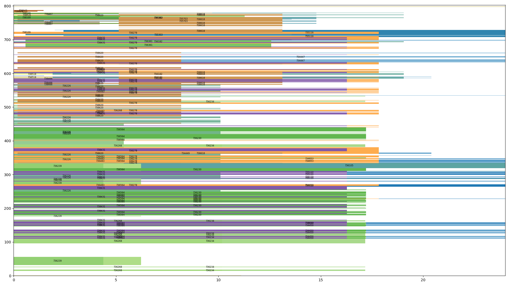

# jobtimize
Visualise the jobs on a cluster scheduler like PBS or SLURM
This tool can draw a job schedule of a cluster manager like PBS by querying all schedulerd jobs for node list and execution time.
That can help you choose a job size to submit effectively and get quicker runs.

## Example output

The x-axis is in hours, and the y-axis is the node number.

## Usage
```bash
python draw_jobs.py
```
will write to a file `jobs.png` which you can view locally.
